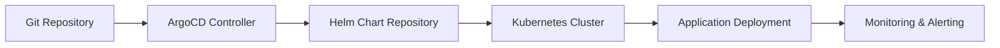

# Architecture

This document describes the architecture and design principles of the GitOps ArgoCD repository.

## 🏗️ Repository Structure

```
fleet-infra/
├── argocd/                          # ArgoCD configuration
│   ├── projects/                    # ArgoCD Projects
│   │   ├── default-project.yaml     # Default project for applications
│   │   └── infrastructure-project.yaml # Infrastructure project
│   ├── applications/                # Individual ArgoCD Applications
│   │   ├── nginx-ingress-application.yaml
│   │   ├── cert-manager-application.yaml
│   │   ├── dev-example-app.yaml
│   │   └── prod-example-app.yaml
│   └── applicationsets/             # Multi-environment ApplicationSets
│       ├── example-app-applicationset.yaml
│       └── infrastructure-applicationset.yaml
├── apps/                            # Application components
│   ├── base/                        # Base application configurations
│   ├── components/                  # Reusable application components
│   └── overlays/                    # Environment-specific overlays
├── infrastructure/                  # Infrastructure components
│   ├── base/                        # Base infrastructure
│   ├── components/                  # Reusable infrastructure
│   └── overlays/                    # Environment-specific overlays
└── docs/                           # Documentation
```

## 🎯 Design Principles

### 1. GitOps First
- Git as the single source of truth
- Declarative configuration management
- Automated deployments triggered by Git changes
- Version control for all configurations

### 2. Separation of Concerns
- **Applications**: Business logic and user-facing services
- **Infrastructure**: Platform services and tooling
- **Projects**: Access control and resource management
- **Environments**: Environment-specific configurations

### 3. Helm Chart Integration
- All applications use Helm charts from `charts.huytran.dev`
- Consistent deployment patterns across environments
- Environment-specific value overrides
- Version management and rollback capabilities

### 4. Multi-Environment Strategy
- **Development**: Fast iteration, minimal resources
- **Staging**: Production-like testing environment
- **Production**: High availability, security, monitoring

## 🔧 Core Components

### ArgoCD Projects

Projects provide access control and resource management:

```yaml
apiVersion: argoproj.io/v1alpha1
kind: AppProject
metadata:
  name: default
spec:
  sourceRepos: ['*']
  destinations:
    - namespace: '*'
      server: https://kubernetes.default.svc
  clusterResourceWhitelist:
    - group: ''
      kind: Namespace
  namespaceResourceWhitelist:
    - group: 'apps'
      kind: Deployment
    - group: 'networking.k8s.io'
      kind: Ingress
```

### ArgoCD Applications

Individual applications for specific use cases:

```yaml
apiVersion: argoproj.io/v1alpha1
kind: Application
metadata:
  name: example-app
spec:
  project: default
  source:
    repoURL: https://charts.huytran.dev
    chart: example-app
    targetRevision: "1.0.0"
    helm:
      values: |
        replicaCount: 1
        environment: dev
  destination:
    server: https://kubernetes.default.svc
    namespace: dev
  syncPolicy:
    automated:
      prune: true
      selfHeal: true
```

### ArgoCD ApplicationSets

Multi-environment deployments using generators:

```yaml
apiVersion: argoproj.io/v1alpha1
kind: ApplicationSet
metadata:
  name: example-app
spec:
  generators:
    - list:
        elements:
          - environment: dev
            replicaCount: 1
          - environment: prod
            replicaCount: 3
  template:
    spec:
      source:
        repoURL: https://charts.huytran.dev
        chart: example-app
        helm:
          values: |
            replicaCount: {{replicaCount}}
            environment: {{environment}}
```

## 🌍 Environment Strategy

### Development Environment
- **Purpose**: Development and testing
- **Resources**: Minimal (1 replica, low CPU/memory)
- **Features**: Debug logging, quick deployments
- **Security**: Basic RBAC, no production secrets

### Staging Environment
- **Purpose**: Integration testing and validation
- **Resources**: Medium (2 replicas, moderate resources)
- **Features**: Production-like configuration
- **Security**: Enhanced RBAC, test certificates

### Production Environment
- **Purpose**: Live user traffic
- **Resources**: High availability (3+ replicas, high resources)
- **Features**: TLS/HTTPS, comprehensive monitoring
- **Security**: Strict RBAC, production certificates, network policies

## 🔄 Deployment Flow



### 1. Git Change
- Developer commits changes to Git repository
- ArgoCD detects changes via webhook or polling

### 2. ArgoCD Processing
- ArgoCD controller reads application configuration
- Validates against project permissions
- Generates Kubernetes manifests from Helm charts

### 3. Helm Chart Resolution
- Fetches Helm chart from `charts.huytran.dev`
- Applies environment-specific values
- Renders Kubernetes manifests

### 4. Kubernetes Deployment
- Applies manifests to target cluster
- Monitors deployment status
- Reports health and sync status

### 5. Monitoring
- Prometheus collects metrics
- Grafana displays dashboards
- Alerts trigger on issues

## 🔐 Security Architecture

### Access Control
- **ArgoCD Projects**: Define resource permissions
- **RBAC**: Kubernetes role-based access control
- **Namespaces**: Environment isolation
- **Network Policies**: Pod-to-pod communication rules

### Secrets Management
- **External Secrets**: Integration with external secret stores
- **Sealed Secrets**: Encrypted secrets in Git
- **Certificates**: TLS certificates via cert-manager

### Security Policies
- **Pod Security Standards**: Non-root containers
- **Network Policies**: Controlled pod communication
- **Resource Limits**: CPU and memory constraints

## 📊 Monitoring & Observability

### Application Monitoring
- **Prometheus**: Metrics collection
- **Grafana**: Dashboards and visualization
- **Alertmanager**: Alert routing and notification
- **ServiceMonitors**: Automatic service discovery

### ArgoCD Monitoring
- **Application Health**: Sync status and health checks
- **Deployment Metrics**: Success/failure rates
- **Resource Usage**: CPU and memory consumption
- **Audit Logs**: Deployment history and changes

## 🚀 Scalability Considerations

### Horizontal Scaling
- **Application Replicas**: Environment-specific scaling
- **ArgoCD Controller**: Multiple replicas for high availability
- **Database**: PostgreSQL clustering for ArgoCD

### Resource Management
- **Resource Quotas**: Namespace-level resource limits
- **Pod Disruption Budgets**: High availability during updates
- **Horizontal Pod Autoscaling**: Automatic scaling based on metrics

### Performance Optimization
- **Helm Chart Caching**: Reduce chart download time
- **Manifest Generation**: Optimized template rendering
- **Sync Strategies**: Efficient resource synchronization

## 🔧 Configuration Management

### Environment Variables
- **ConfigMaps**: Non-sensitive configuration
- **Secrets**: Sensitive data management
- **External Configuration**: Integration with external systems

### Feature Flags
- **Environment-Specific Features**: Gradual rollout
- **A/B Testing**: Multiple application versions
- **Canary Deployments**: Risk mitigation strategies

## 📈 Best Practices

### GitOps Workflow
1. **Plan**: Design changes in feature branches
2. **Review**: Pull request review process
3. **Test**: Automated testing in staging
4. **Deploy**: Automated deployment to production
5. **Monitor**: Continuous monitoring and alerting

### Helm Chart Management
1. **Version Control**: Semantic versioning for charts
2. **Testing**: Local chart testing before deployment
3. **Documentation**: Comprehensive chart documentation
4. **Security**: Regular security scanning

### Application Development
1. **Containerization**: Consistent container images
2. **Health Checks**: Proper liveness and readiness probes
3. **Resource Limits**: CPU and memory constraints
4. **Logging**: Structured logging and log aggregation 